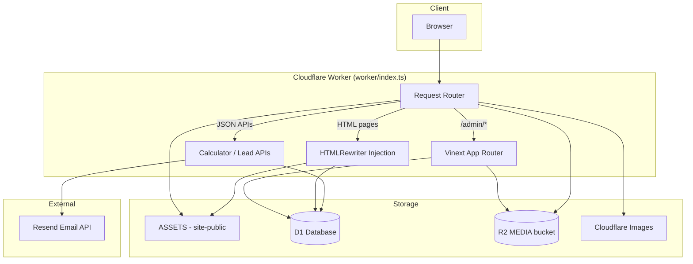

# Architecture

## High-Level Overview



## Technology Stack

| Layer | Technology | Location |
| --- | --- | --- |
| Framework | Vinext 0.0.45 (Next.js App Router on Vite) | `vite.config.ts` |
| UI | React 19, Tailwind CSS 4 | `app/`, `app/globals.css` |
| Runtime | Cloudflare Workers (`nodejs_compat`) | `worker/index.ts` |
| Database | Cloudflare D1 + Drizzle ORM 0.45 | `worker/db/` |
| Object storage | Cloudflare R2 | `worker/admin/media-store.ts` |
| Static assets | `site-public/` via ASSETS binding | ~1000+ HTML pages |
| Email | Resend HTTP API | `worker/lead-email.ts` |
| Build | Vite 8 + `@cloudflare/vite-plugin` | `npm run build` → `dist/` |
| Deployment | OpenAI Sites | `.openai/hosting.json` |

## Repository Layout

```
viraayaweddings.com/
├── app/                    # Vinext App Router (admin + API routes)
│   ├── admin/              # Full CMS admin panel (58 files)
│   ├── api/                # Public API routes
│   └── */route.ts          # Lead/calculator route handlers
├── worker/                 # Cloudflare Worker entry + site logic
│   ├── index.ts            # Main fetch router (861 lines)
│   ├── db/                 # Schema, client, migrations
│   ├── admin/              # Session, passwords, media, leads
│   ├── site/               # HTML injection layer
│   └── lead-email.ts       # Lead capture + Resend
├── site-public/            # Static cloned website
├── drizzle/                # SQL migrations (0000–0024)
├── build/                  # Vite plugin + Python verify scripts
├── docs/                   # This documentation system
├── scripts/                # docs:inventory, docs:validate, docs:sync
└── .openai/hosting.json    # D1/R2 binding config for deployment
```

## Request Flow

### Public HTML Page (managed content)

```
GET /destination-wedding/udaipur/taj-lake-palace
  → worker/index.ts matches path
  → resolve-page.ts loads page_templates + hotels + labels + settings
  → ASSETS fetches static shell HTML
  → HTMLRewriter (hotel-inject.ts) patches content
  → Response with 60s cache, security headers
```

### Admin Panel

```
GET /admin/blogs
  → worker routes /admin/* to Vinext (no-cache, noindex)
  → app/admin/layout.tsx → requireUser()
  → app/admin/blogs/page.tsx renders with D1 queries
```

### Lead Form Submission

```
POST /contact/save (same-origin)
  → handleLeadRequest (worker/lead-email.ts)
  → Validate + rate limit + honeypot
  → INSERT leads
  → POST Resend API
  → UPDATE leads.email_sent
```

## Rendering Models

| Model | Description | Example |
| --- | --- | --- |
| **Static** | Served as-is from `site-public/` | Legacy pages without DB overrides |
| **Injected** | Static shell + HTMLRewriter patches | Venue pages, blog posts, homepage hero |
| **Database-only** | Full HTML from `page_templates` | Pages with no static file |
| **Preview** | `?preview=1` + admin session | Draft content, noindex |

## Deployment Architecture

1. `npm run build` produces `dist/client` (static) + `dist/server` (worker).
2. `build/sites-vite-plugin.ts` copies `.openai/` and `drizzle/` to `dist/`.
3. Patches `dist/server/wrangler.json` for asset routing.
4. Worker bindings configured via `.openai/hosting.json`:
   - `DB` → D1 database
   - `MEDIA` → R2 bucket
   - `ASSETS` → static files (added at build)

**No checked-in `wrangler.toml`** — generated at build time.

## Security Headers

Applied to all worker responses (`worker/index.ts`):

- Content-Security-Policy (restricts scripts, frames, connect)
- Strict-Transport-Security
- Cross-Origin-Opener-Policy / Cross-Origin-Resource-Policy
- Referrer-Policy
- Same-origin checks on sensitive calculator and lead endpoints

## Caching Strategy

| Content | Cache |
| --- | --- |
| Static assets (`/assets/*`, `/storage/*`) | Long-lived, bypass worker |
| Injected HTML pages | 60 seconds |
| Admin panel | `no-store`, `noindex` |
| Preview mode | `no-store`, `noindex` |
| `/media/*` R2 objects | Immutable long cache |

## Related Documents

- [Route Map](./03-routes.md)
- [Database](./05-database.md)
- [Configuration](./09-configuration.md)
- [Deployment placeholder](./deployment/README.md)
