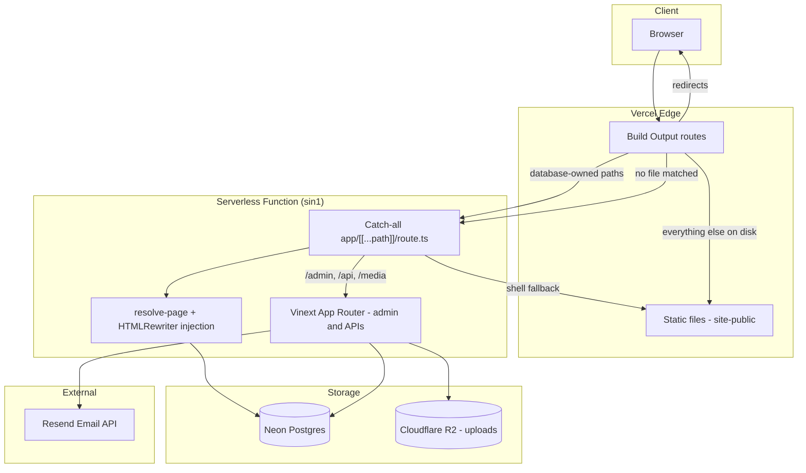

# Architecture

## High-Level Overview



## Technology Stack

| Layer | Technology | Location |
| --- | --- | --- |
| Framework | Vinext 0.0.45 (Next.js App Router on Vite 8) | `vite.config.ts` |
| UI | React 19, Tailwind CSS 4 | `app/`, `app/globals.css` |
| Runtime | Vercel serverless function, Node 24, region `sin1` | `vercel.json` |
| Build | `vinext build` + Nitro `vercel` preset | `npm run build` → `.vercel/output` |
| Database | Neon Postgres + Drizzle ORM 0.45 (`postgres.js`) | `worker/db/` |
| Object storage | Cloudflare R2 over the S3 API | `worker/storage/r2.ts` |
| HTML rewriting | `html-rewriter-wasm` (lol-html), same engine Cloudflare runs | `worker/html-rewriter.ts` |
| Static site | `site-public/` copied into the deploy output | 433 files, 292 of them pages |
| Email | Resend HTTP API | `worker/lead-email.ts` |

The function is pinned to `sin1` because Neon is in `ap-southeast-1`. Both are
Singapore. See [Configuration](./09-configuration.md#function-region).

## Repository Layout

```
viraayaweddings.com/
├── app/                    # Vinext App Router
│   ├── [[...path]]/        # Catch-all: public pages, redirects, 404
│   ├── admin/              # CMS admin panel
│   ├── api/                # Public API routes
│   ├── media/[...path]/    # Serves R2 uploads
│   └── */route.ts          # Legacy form endpoints
├── worker/                 # Server logic, shared by every route
│   ├── db/                 # Schema, client, migrations, seeds
│   ├── admin/              # Sessions, passwords, media, rich text
│   ├── site/               # Page resolution and content injection
│   ├── storage/r2.ts       # R2 through @aws-sdk/client-s3
│   ├── html-rewriter.ts    # Installs HTMLRewriter on Node
│   └── lead-email.ts       # Lead capture + Resend
├── site-public/            # Static site: HTML, CSS, JS, images
├── drizzle-pg/             # Postgres migrations (applied at runtime)
├── drizzle/                # Legacy SQLite migrations, kept as content seeds
├── build/                  # Vite plugin + Python render checks
├── scripts/                # docs tooling, migrations, output verification
└── vercel.json             # Build command, install command, region
```

## Request Flow

Routing is decided twice: once by Vercel's Build Output config, then again
inside the function. The generated order is in `.vercel/output/config.json`.

### Vercel routes, in order

1. **Redirects** — retired URLs, emitted from `PUBLIC_REDIRECTS`. These come
   first because several of them still have a file in `site-public`, which
   would otherwise win.
2. **Database-owned rewrites** — `/`, `/contact`, `/blogs/**` and
   `/destination-wedding/**` go to the function. Each carries
   `missing: x-vw-shell`, so a request that already has that header falls
   through instead of matching.
3. **`handle: filesystem`** — everything else that exists on disk is served
   straight from the CDN.
4. **Catch-all** — anything left goes to the function.

### Public page the database owns

```
GET /destination-wedding/agra/itc-mughal-agra
  → Vercel rewrites to the function
  → app/[[...path]]/route.ts
  → resolvePage() loads the shell from page_templates, plus hotel, labels, settings
  → injectManagedContent() rewrites the shell through HTMLRewriter
  → enhancePublicHtml() adds the skip link, cookie script, lazy images
  → 200, cache-control public, max-age=30
```

If the shell is missing or the database is unreachable, the handler fetches the
page's original markup back through its own origin with `x-vw-shell: 1` — which
the rewrite treats as a miss — and injects into that instead. A page is never
lost to a database problem.

### Public page the database does not own

```
GET /about-us
  → no rewrite matches
  → handle: filesystem serves site-public/about-us/index.html from the CDN
  → the function is never invoked
```

### Admin panel

```
GET /admin/blogs
  → catch-all is not involved; the App Router owns /admin
  → app/admin/layout.tsx → requireUser()
  → app/admin/blogs/page.tsx queries Postgres
  → no-store, noindex
```

### Lead form submission

```
POST /api/lead (same-origin)
  → handleLeadRequest (worker/lead-email.ts)
  → validate + rate limit + honeypot
  → INSERT leads
  → POST Resend API
  → UPDATE leads.email_sent
```

## Rendering Models

| Model | Description | Example |
| --- | --- | --- |
| **Static** | Served from the CDN, untouched | `/about-us`, `/faqs` |
| **Database-rendered** | Includes `/` — the homepage is *not* static | Homepage, venues, articles, city indexes |
| **Database-rendered** | Shell from `page_templates`, filled by injection | Homepage, venue pages, articles |
| **Injected fallback** | Original markup with managed content patched in | A managed path whose shell is missing |
| **Preview** | `?preview=1` with an admin session | Draft content, noindex |

## Deployment

1. `npm run build` runs `vinext build`, which invokes Nitro's `vercel` preset.
2. Nitro writes `.vercel/output`: `static/` (the whole of `site-public` plus
   hashed assets), `functions/__server.func/`, and `config.json`.
3. `scripts/verify-vercel-output.mjs` then fails the build unless the output is
   actually deployable — config present, filesystem handler, a route to the
   function, and `static/index.html`.
4. Vercel deploys the Build Output directly. There is no framework preset.

`site-public` is registered with Nitro explicitly. Nitro only picks up Vite's
own client build directory, so without that the deploy ships an empty static
directory and every public URL 404s.

## Security Headers

**`vercel.json` is what actually sets them.** Its `headers` array carries the
CSP, HSTS, COOP/CORP, Referrer-Policy, Permissions-Policy and frame options for
`/(.*)`, plus a stricter block for `/admin/:path*` — `X-Frame-Options: DENY`,
`no-store`, and a CSP with no `frame-src` and `frame-ancestors 'none'`.

`build/sites-vite-plugin.ts` also writes a `_headers` file into `dist/client`,
and **that file has no effect on this deployment.** `_headers` is a Cloudflare
Pages convention; Nitro's `vercel` preset builds `.vercel/output` and never
copies it, which is verifiable — `find .vercel/output -name _headers` returns
nothing after a build. It is a leftover from the Cloudflare deployment. Editing
it to change a header on production will silently do nothing; edit `vercel.json`.

Same-origin checks guard the admin upload route, logout, and the lead
endpoints.

## Caching

| Content | Cache | Set by |
| --- | --- | --- |
| Hashed build assets (`/assets/*`) | `max-age=31536000, immutable` | `_headers` — see the caveat above; Vercel's own defaults apply in practice |
| Static files served by the CDN | Vercel's defaults for the Build Output | Vercel |
| Static files served by the **function** as a fallback | `max-age=0, must-revalidate` for HTML, `max-age=31536000, immutable` for everything else | `cacheControlFor` in `worker/site/serve-static.ts` |
| Database-rendered pages | `max-age=30` (`MANAGED_CACHE_CONTROL`) | `worker/site/render-page.ts` |
| `?preview=1` renders | `no-store` + `x-robots-tag: noindex, nofollow` | `worker/site/render-page.ts` |
| `/media/*` R2 objects | `max-age=31536000, immutable` | `worker/site/media.ts` |
| Admin panel | `no-store`, `noindex` | `vercel.json` + `app/admin/layout.tsx` |

`cacheControlFor` applies **only** on the catch-all's static-file fallback path,
not to the CDN's own responses — most static files never reach the function at
all. Note that it returns `immutable` for any non-HTML file, and the files under
`site-public` are not content-hashed, so a replaced image can be served stale
from a client cache for a long time. Replacing an image through the admin panel
avoids this: those go to `/media/<hash>`, where the key changes with the bytes.

Because media keys are the SHA-256 of the file, a key can never point at
different bytes, so an immutable cache is safe — but a deleted object can still
be served from the edge for a while.

## Related Documents

- [Route Map](./03-routes.md)
- [Database](./05-database.md)
- [Configuration](./09-configuration.md)
- [Deployment](./deployment/vercel-postgres-r2.md)
