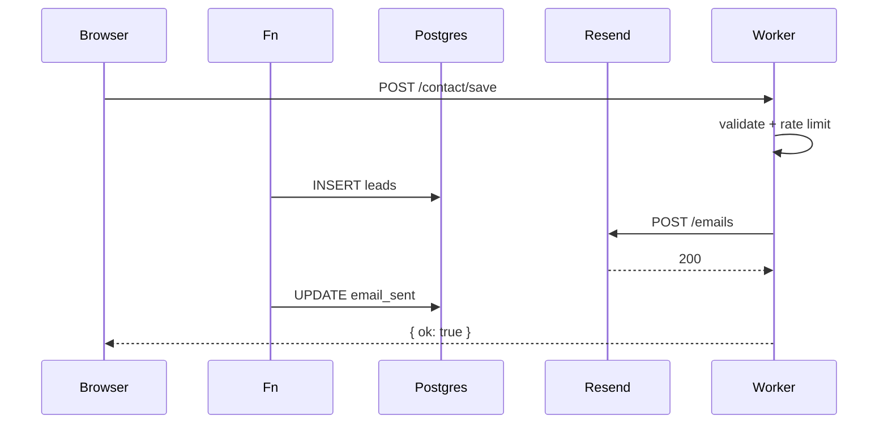

# API Reference

Complete HTTP API inventory.

---

## Public Lead APIs

All lead endpoints share `handleLeadRequest` from `worker/lead-email.ts`.

### POST `/api/lead`

| | |
| --- | --- |
| **App route** | `app/api/lead/route.ts` |
| **Catch-all** | `app/[[...path]]/route.ts` |
| **Auth** | Same-origin check on POST |
| **Body** | Form fields (varies by form) |
| **Validation** | Honeypot, rate limit, field extraction |
| **Response** | JSON `{ ok: true }` or error |
| **DB** | INSERT `leads` |
| **External** | POST Resend API |
| **Side effects** | `leads.email_sent` updated on success |

### POST `/contact/save`

Same handler as `/api/lead`. Used by contact page form.

### POST `/get_in_touch/store`

Same handler. Used by get-in-touch form.

### POST `/blog-form-submit`

Same handler. Used by blog enquiry forms.

### OPTIONS (all lead routes)

CORS preflight for same-origin POST.

---

## Calculator / Search APIs

Data source: the `calculator_*` tables in Postgres, read through
`worker/site/calculator-store.ts` and edited at `/admin/calculator`.
`worker/calculator-data.ts` is the seed those tables are first filled from, not
a fallback the endpoints read.

| Endpoint | Method | Auth | Purpose | Response |
| --- | --- | --- | --- | --- |
| `/hotel-search?q=` | GET | None | Hotel name search (8 results) | JSON array |
| `/get-cities?search=` | GET | Same-origin | City autocomplete | JSON |
| `/get-hotels-by-city?city=` | GET | Same-origin | Hotels for comparison | JSON |
| `/get-hotels-by-city/:cityId` | GET | Same-origin | Hotels by city ID | JSON |
| `/get-hotel-price/:id/:month` | GET | Same-origin | Monthly price | JSON |
| `/get-hotel-prices` | POST | Same-origin | Batch prices | JSON |
| `/api/calculator/budget-match` | POST | Same-origin | Prices every hotel in a city against one enquiry and flags which fit the chosen band | JSON |
| `/api/calculator/data` | GET | None | The whole dataset in one response | JSON |
| `/data/calculator/cities.json` | GET | None | India cities | JSON |
| `/data/calculator/hotels.json` | GET | None | All India hotels | JSON |
| `/data/calculator/hotels-by-city.json` | GET | None | Hotels grouped | JSON |
| `/data/calculator/prices.json` | GET | None | Price matrix | JSON |
| `/data/calculator/currencies.json` | GET | None | INR only | JSON |
| `/data/calculator/taxes.json` | GET | None | Published tax lines | JSON |
| `/data/calculator/budgets.json` | GET | None | Published budget bands | JSON |
| `/api/currencies` | GET | None | Currency list | JSON |
| `/api/currencies/select` | POST | Same-origin | Stores the chosen currency in a cookie | `{ok:true, currency}` |
| `/appointment/slots` | GET | None | Time slots | JSON array |

---

## Media APIs

### GET `/media/:key`

| | |
| --- | --- |
| **Handler** | `worker/site/media.ts` |
| **Auth** | None |
| **Source** | R2 MEDIA bucket |
| **Cache** | Immutable long cache |

### GET `/_vinext/image`

| | |
| --- | --- |
| **Handler** | Vinext image optimization |
| **Auth** | None |
| **Source** | `site-public/storage/` on the CDN, plus R2 for uploads |

---

## Admin APIs

### GET `/admin/search?q=`

| | |
| --- | --- |
| **File** | `app/admin/search/route.ts` |
| **Auth** | Session cookie (401 if missing) |
| **Response** | `{ hits: [{ type, title, href, snippet }] }` |
| **DB** | Queries `hotels`, `blogPosts`, `leads`, `cityPages`* |

\*City pages: admin role only.

### GET `/admin/leads/export`

| | |
| --- | --- |
| **File** | `app/admin/leads/export/route.ts` |
| **Auth** | Session cookie |
| **Query** | `q`, `form`, `from`, `to`, `sort`, `dir` |
| **Response** | `text/csv` attachment |
| **DB** | `listAllMatchingLeads` (max 5000) |

### GET `/admin/media/upload`

| | |
| --- | --- |
| **File** | `app/admin/media/upload/route.ts` |
| **Auth** | Session cookie |
| **Response** | JSON media library |

### POST `/admin/media/upload`

| | |
| --- | --- |
| **Auth** | Session + same-origin |
| **Body** | Multipart file |
| **Handler** | `uploadImage` → R2 + `media` |
| **Response** | `{ url, key }` |

### POST `/admin/logout`

| | |
| --- | --- |
| **File** | `app/admin/logout/route.ts` |
| **Auth** | None |
| **DB** | DELETE session |
| **Response** | 303 → `/admin/login` |

---

## Server Actions (Non-REST)

Admin CRUD uses Next.js server actions (POST with form data), not REST endpoints. See [Admin Server Actions](./02-admin/actions.md).

| Module | Actions file |
| --- | --- |
| Login | `app/admin/login/actions.ts` |
| Setup | `app/admin/setup/actions.ts` |
| Blogs | `app/admin/blogs/actions.ts` |
| Blog sections | `app/admin/blogs/sections/actions.ts` |
| Hotels | `app/admin/hotels/actions.ts` |
| Cities | `app/admin/cities/actions.ts` |
| Hero | `app/admin/hero/actions.ts` |
| Labels | `app/admin/labels/actions.ts` |
| Settings | `app/admin/settings/actions.ts` |
| Users | `app/admin/users/actions.ts` |
| Media | `app/admin/media/actions.ts` |
| Leads | `app/admin/leads/actions.ts` |

---

## Error Responses

| Context | Behavior |
| --- | --- |
| Lead validation failure | 400 JSON with message |
| Lead rate limit | 429 JSON |
| Admin API without session | 401 JSON or redirect |
| Same-origin violation | 403 |
| Calculator blocked paths | 404 |

---

## Request Flow Diagram

