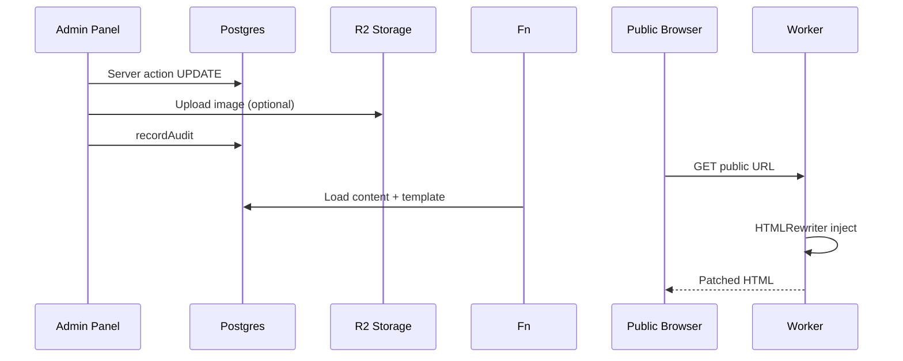

# Workflows

Major end-to-end workflows across the system.

---

## 1. Public Lead Capture

```
Site form (contact/get-in-touch/blog)
  → POST /contact/save (or equivalent)
  → handleLeadRequest (worker/lead-email.ts)
    → Honeypot check
    → Rate limit (per IP)
    → Field extraction (name, email, phone)
    → INSERT leads
    → POST Resend API (notification email)
    → UPDATE leads.email_sent
  → JSON { ok: true } to browser
```

**Failure flows:**
- Validation error → 400 JSON
- Rate limit → 429 JSON
- DB failure → 500 (lead not saved)
- Email failure → lead saved, email_sent=0 (admin can resend)

---

## 2. Admin Authentication

See [Admin Workflows — Login](./02-admin/workflows.md).

---

## 3. Content Publish (Venue Example)

```
Editor: /admin/hotels/new
  → Fill form (city, slug, name, content)
  → createHotelAction
    → Validate uniqueness
    → Upload banner to R2 + media row
    → INSERT hotels (status=draft or published)
    → recordAudit
  → Redirect ?saved=1

Public: GET /destination-wedding/udaipur/new-venue
  → Worker resolve-page
  → Load page_templates shell
  → Load hotels row
  → HTMLRewriter inject content
  → 60s cached response

Preview: Same URL + ?preview=1 + admin session
  → Includes draft status, no-cache
```

---

## 4. Homepage Hero Update

```
Editor: /admin/hero
  → updateSlideAction
    → UPDATE hero_slides
    → Optional image upload/replace

Public: GET /
  → loadHeroSlides (published, ordered)
  → inject.ts replaces carousel in home shell
  → Cached 60s
```

---

## 5. City Listing Configuration

```
Admin: /admin/cities/udaipur
  → Edit venue order textarea
  → saveCityAction
    → UPDATE city_pages (SEO, totalVenues)
    → DELETE + INSERT city_listings
    → Invalidate listing cache

Public: GET /destination-wedding/udaipur/
  → city_pages + city_listings JOIN hotels
  → venue-listing.ts injects card grid
  → Pagination uses totalVenues
```

---

## 6. Blog Taxonomy Page

```
Admin: /admin/blogs/sections
  → Edit post slugs for category "weeding-planning"
  → saveSectionAction
    → REPLACE blog_listings rows

Public: GET /blogs/category/weeding-planning/
  → blog.ts loads blog_listings + blog_posts
  → Injects listing grid into shell
```

---

## 7. Media Upload & Reference

```
RichText editor drop
  → POST /admin/media/upload
  → Magic-byte type check (JPEG/PNG/WebP/AVIF)
  → Content-hash dedup
  → PUT R2 + INSERT media
  → Returns /media/<key>

Content save references /media/<key> in HTML

Delete attempt
  → findImageReferences scans all content tables
  → If referenced: reject
  → If unused: R2 delete + media row delete
```

---

## 8. Settings Propagation

```
Admin: /admin/settings → saveSettingsAction
  → UPSERT settings rows
  → Invalidate settings cache

Public pages (contact, footer, etc.)
  → loadSiteSettings (30s cache)
  → inject.ts patches phone/email/address/social
```

---

## 9. User Password Reset

```
Admin: /admin/users → resetPasswordAction
  → validatePasswordStrength
  → UPDATE users.password_hash
  → destroyAllUserSessions(userId)
  → User must re-login
```

---

## 10. Build & Deploy

```
Developer: npm run build
  → Vinext build → dist/client + dist/server
  → sites-vite-plugin copies .openai/ + drizzle/
  → Verifies the output is deployable
  → Vercel deploys .vercel/output

Runtime first request
  → worker/db/client.ts applies pending migrations
  → seed-templates.ts inserts page shell HTML
```

---

## Workflow Diagram: Content Edit → Public View


