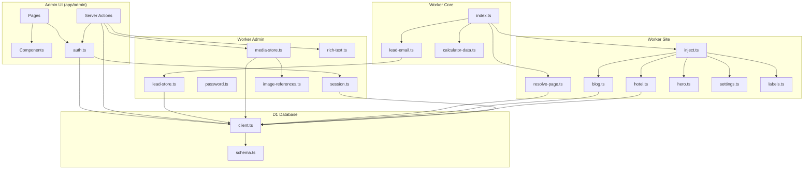

# Dependency Map

Relationships between modules, features, and data.

---

## Module Dependency Graph



---

## Feature → File Dependencies

| Feature | UI | Actions/API | Worker | DB Tables |
| --- | --- | --- | --- | --- |
| Login | `login/page.tsx` | `loginAction` | `session.ts`, `password.ts` | users, sessions |
| Dashboard | `page.tsx` | — | — | leads, hotels, blog_posts, etc. |
| Articles | `blogs/*` | `blogs/actions.ts` | `blog.ts`, `blog-inject.ts` | blog_posts, blog_listings |
| Venues | `hotels/*` | `hotels/actions.ts` | `hotel.ts`, `hotel-inject.ts` | hotels, city_listings |
| City pages | `cities/*` | `cities/actions.ts` | `venue-listing.ts` | city_pages, city_listings |
| Hero | `hero/*` | `hero/actions.ts` | `hero.ts`, `inject.ts` | hero_slides |
| Media | `media/*` | `media/actions.ts`, upload route | `media-store.ts`, `media.ts` | media, R2 |
| Settings | `settings/*` | `settings/actions.ts` | `settings.ts` | settings |
| Labels | `labels/*` | `labels/actions.ts` | `labels.ts` | site_labels |
| Users | `users/*` | `users/actions.ts` | `session.ts`, `password.ts` | users, sessions |
| Leads | `leads/*` | `leads/actions.ts`, export | `lead-email.ts`, `lead-store.ts` | leads |
| Activity | `activity/page.tsx` | — | — | audit_log |
| Lead forms (public) | site-public forms | app route handlers | `lead-email.ts` | leads |
| Calculator | site-public JS | — | `calculator-data.ts` | — |

---

## External Integration Dependencies

| Integration | Required by | Optional when |
| --- | --- | --- |
| D1 (`DB`) | All admin + content injection | Never optional in prod |
| R2 (`MEDIA`) | Media upload/serve | Static paths work without R2 |
| Resend | Lead email notifications | Leads still saved without key |
| ASSETS | Static site serving | Required |
| IMAGES | Image optimization | Falls back without binding |

---

## Component Reuse Dependencies

```
nav.ts
  ├── SideNav.tsx
  ├── ShellChrome.tsx (breadcrumb)
  └── CommandPalette.tsx

auth.ts
  ├── All admin pages
  ├── All server actions
  └── Admin API routes

RichText.tsx
  ├── blogs/_form.tsx
  └── hotels/[id]/page.tsx

ImageInput.tsx
  ├── blogs/_form.tsx
  ├── hotels/[id]/page.tsx
  └── hero/page.tsx
```

---

## Data Flow Dependencies

```
Content change in admin
  → Server action
  → D1 UPDATE
  → Cache invalidation (module-level)
  → Next public request loads fresh data
  → HTMLRewriter injects into shell
```

```
Image upload
  → media-store.uploadImage
  → R2 PUT
  → media INSERT
  → URL returned to form
  → Saved in content HTML as /media/<key>
  → image-references tracks usage
```
