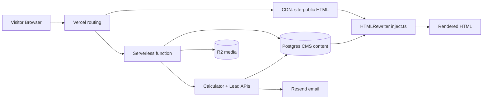

# Public Website — Overview

Complete documentation for the customer-facing Viraaya Weddings website.

| | |
| --- | --- |
| **Static source** | `site-public/` (367 HTML pages) |
| **Runtime** | Vercel CDN, plus a serverless function for managed pages |
| **Rendering** | Static HTML, or a stored shell filled via HTMLRewriter |
| **Auth** | None (anonymous visitors) |
| **Payments** | None — all forms are lead capture |
| **Admin connection** | See [Website ↔ Admin Map](./website-admin-map.md) |

---

## Architecture Summary

The public site is a **cloned static HTML website** augmented at request time by CMS content from the admin panel. There is no React/Vue public frontend — pages are pre-built HTML with jQuery/Bootstrap client scripts.

---

## Documentation Index

| Document | Contents |
| --- | --- |
| [Architecture](./architecture.md) | Request flow, caching, preview mode |
| [Route Map](./routes.md) | All 367+ public URL patterns |
| [Page Types](./page-types.md) | Page taxonomy and shared chrome |
| [Forms](./forms.md) | Every lead/enquiry form |
| [JavaScript](./javascript.md) | Client-side behavior |
| [Rendering & Injection](./rendering.md) | HTMLRewriter, stored shells |
| [Search & Calculator](./search-calculator.md) | Discovery tools and pricing APIs |
| [Booking & Consultation](./booking-consultation.md) | Appointment flows (lead-only) |
| [SEO](./seo.md) | Metadata, gaps, admin overrides |
| [Content Management](./content-management.md) | What comes from admin vs static |
| [Website ↔ Admin Map](./website-admin-map.md) | **Critical:** admin change → site effect |
| [Workflows](./workflows.md) | End-to-end visitor flows |

---

## Key Facts

| Topic | Answer |
| --- | --- |
| User login/registration | **Does not exist** on public site |
| User dashboard | **Does not exist** |
| Real-time chat | **Does not exist** |
| Payment processing | **Does not exist** — consultation "payment" pages are static thank-you pages |
| Onboarding | **Does not exist** |
| Blog | 11 articles + listing + 2 categories + 2 tags |
| Venues | 259 detail pages across 53 cities |
| Lead capture | All enquiry forms → Postgres `leads` + Resend email |
| Preview drafts | `?preview=1` requires admin session |

---

## Shared Page Chrome

Most pages include:

- Header megamenu (Hotels by city tabs)
- Footer (contact, social, legal links)
- WhatsApp floating button
- Search overlay (`#searchbox` → `/hotel-search`)
- Modals: `#BookConsultation`, `#enquiryModal`
- Google Analytics `G-8KV1YV2GD8`

**Theme assets:** `site-public/user/assets/css/style.css`, `site-public/user/assets/js/custom.js`

---

## Related Master Docs

- [Architecture](../01-architecture.md) — system-wide design
- [API Reference](../04-api.md) — public endpoints
- [Database](../05-database.md) — tables powering injected content
- [Admin Panel](../02-admin/README.md) — CMS (already documented)
- [Workflows](../07-workflows.md) — includes lead capture flow

## Separate Audit Report

Website-specific bugs and recommendations: [WEBSITE-AUDIT-FINDINGS.md](../WEBSITE-AUDIT-FINDINGS.md)
