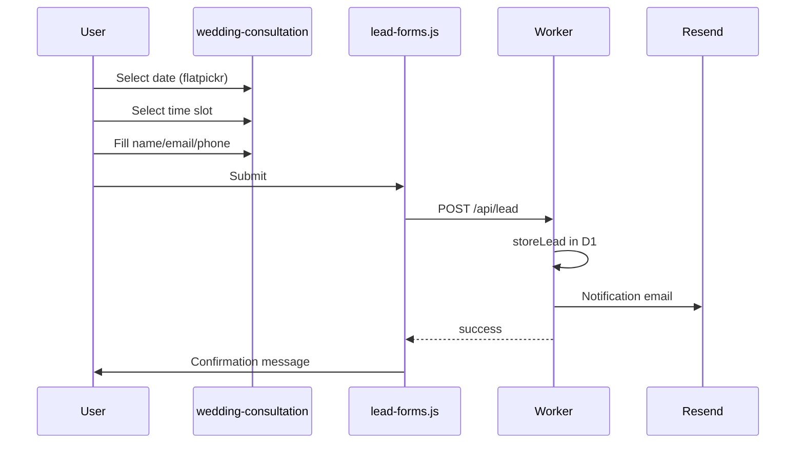

# Public Website — Booking & Consultation

Consultation and availability flows on the public site.

**Important:** There is **no payment processing**. All flows capture leads only.

---

## Flow Summary

| Flow | Page | Payment? | Actual behavior |
| --- | --- | --- | --- |
| Wedding consultation | `/wedding-consultation/` | No | Lead → email |
| Appointment booking | `/appointment-booking/` | No | Lead → email (duplicate of consultation) |
| Check availability | `/check-hotel-availability/` | No | Lead → email; UI shows "BOOKED" cosmetically |
| Payment success | `/appointment/payment-success/` | No | Static thank-you page |
| Payment failed | `/appointment/payment-failed/` | No | Static failure page |

---

## Consultation Booking Flow

### Pages

| Route | File | Notes |
| --- | --- | --- |
| `/wedding-consultation/` | `site-public/wedding-consultation/index.html` | Primary consultation page |
| `/appointment-booking/` | `site-public/appointment-booking/index.html` | Near-identical duplicate |

### Time slots

| Source | Slots |
| --- | --- |
| **Page hardcoded** | `11:00, 12:00, 13:00, 14:00, 15:00, 16:00, 17:00, 18:00, 19:00` |
| **Worker `/appointment/slots`** | `10:00, 11:00, 12:00, 14:00, 15:00, 16:00` — **unused by pages** |

### Hidden form fields set by JS

| Field | Set by |
| --- | --- |
| `appointment_date` | Flatpickr selection |
| `appointment_time` | Slot click |
| `enquiry_type` | Static/hardcoded |

### Worker appointment mode

`lead-email.ts` supports `LeadResponseMode: "appointment"` — returns fake `order_id` in response. Used for consultation form identification.

---

## Check Availability Wizard

**Page:** `/check-hotel-availability/`

| Step | User action | Data collected |
| --- | --- | --- |
| 1 | Select wedding plan type | `plan` |
| 2 | Select hotels | `hotels[]` |
| 3 | Select dates | `dates` |
| 4 | Enter contact details | `name`, `email`, `phone`, `user-city` |

**Submit:** jQuery `$.ajax` POST JSON to `/api/lead`  
**Success UI:** Shows "BOOKED" confirmation — **no reservation is made**  
**Admin view:** Full wizard data in `leads.fields` JSON

---

## Payment Pages (Static Only)

### `/appointment/payment-success/`

| | |
| --- | --- |
| **File** | `site-public/appointment/payment-success/index.html` |
| **Content** | "Consultation request received" message |
| **Canonical** | Points to `/wedding-consultation` |
| **Logic** | None — pure static HTML |

### `/appointment/payment-failed/`

| | |
| --- | --- |
| **File** | `site-public/appointment/payment-failed/index.html` |
| **Content** | Failure message |
| **Retry logic** | None |

**No payment gateway integration exists anywhere in the codebase.**

---

## Modal Consultation (Sitewide)

`#BookConsultation` modal on homepage, packages, venue pages:

| Field | Required |
| --- | --- |
| `name`, `email`, `number` | yes |
| `source_page` | hidden — current URL |

Same lead pipeline as full-page consultation.

---

## Admin Panel Connection

| Public action | Admin location |
| --- | --- |
| View consultation request | `/admin/leads` — filter by form name |
| Update lead status | `/admin/leads/:id` |
| Resend notification email | `/admin/leads/:id` → Resend |
| Configure email recipient | `.env` `RESEND_TO_EMAIL` + `/admin/settings` (contact details only) |

**Admin cannot:** Manage appointment slots, calendar availability, or booking confirmations — these don't exist server-side.

---

## What's Missing (vs typical booking systems)

| Feature | Status |
| --- | --- |
| Payment gateway | Not implemented |
| Booking calendar backend | Not implemented |
| Slot availability API (connected) | Endpoint exists, unused |
| Confirmation emails to user | Only internal Resend notification |
| User account for bookings | Not implemented |
| Refund/cancellation | Not applicable |

See [WEBSITE-AUDIT-FINDINGS.md](../WEBSITE-AUDIT-FINDINGS.md) for related issues.
