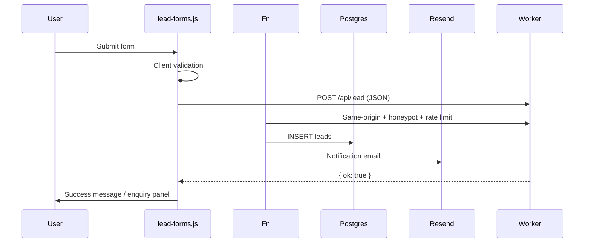

# Public Website — Forms

Every customer-facing form on the website.

**Universal handler:** `worker/lead-email.ts` → `handleLeadRequest()`  
**Client interceptor:** `site-public/js/lead-forms.js` — intercepts POST forms and submits JSON to `/api/lead`  
**Storage:** Postgres `leads` table + Resend notification email

---

## Lead Form Pipeline

---

## Client Validation (`lead-forms.js`)

| Rule | Pattern / logic |
| --- | --- |
| Intercepted actions | `/api/lead`, `/contact/save`, `/blog-form-submit`, `#`, `""` |
| Email | `/^[^\s@]+@[^\s@]+\.[^\s@]{2,}$/` |
| Phone | Indian 10-digit: `/^(?:\+?91[\s-]?)?[6-9]\d{9}$/` |
| Required fields | Per-form `required` attributes + custom checks |
| Honeypot | Hidden `website` / `company_website` fields |
| Accessibility | `aria-invalid`, `aria-describedby`, `.lead-field-error`, `role="status"` |
| Duplicate submit | Submit button disabled during fetch |

Forms get `form.noValidate = true` — browser validation bypassed in favor of custom validation.

---

## Server Validation (`worker/lead-email.ts`)

| Rule | Detail |
| --- | --- |
| Same-origin | POST must come from same origin |
| Rate limit | 8 submissions / 10 min / IP (Postgres `rate_limits`, trusted IP headers) |
| Body size | Max 20KB |
| Name | Minimum 2 characters |
| Phone | Indian 10-digit, `+91` normalized |
| Email | Regex validation |
| Honeypot | Rejects if honeypot field filled |
| OTP fields | Rejected if field names match OTP patterns |

**On success:** `{ ok: true }` or appointment-mode payload  
**On failure:** 400/429 JSON with message  
**Email failure:** Lead still saved; `email_sent = 0`

---

## Form Inventory

### 1. Contact Page Form (`#contactForm`)

| | |
| --- | --- |
| **Page** | `/contact/` — `site-public/contact/index.html` |
| **HTML action** | `/contact/save` |
| **Actual submit** | `/api/lead` via JS |
| **Purpose** | General contact enquiry |

| Field | name | Required | Notes |
| --- | --- | --- | --- |
| Name | `name` | yes | |
| Email | `email` | yes | |
| Phone | `number` | yes | |
| Subject | `subject` | yes | Select dropdown |
| Message | `message` | no | |

---

### 2. Consultation Form (`#consultationForm`)

| | |
| --- | --- |
| **Pages** | `/wedding-consultation/`, `/appointment-booking/`, modal on most pages |
| **HTML action** | `/contact/save` or `/api/lead` |
| **Purpose** | Book wedding consultation |

| Field | name | Required | Notes |
| --- | --- | --- | --- |
| Name | `name` | yes | |
| Email | `email` | yes | |
| Phone | `number` | yes | |
| City | `city` | yes | On full-page forms |
| Appointment date | `appointment_date` | hidden | Set by flatpickr |
| Appointment time | `appointment_time` | hidden | Set by slot picker |
| Enquiry type | `enquiry_type` | hidden | |
| Source page | `source_page` | hidden | In modals |

---

### 3. Venue Enquiry Form (`#enquiryForm`)

| | |
| --- | --- |
| **Pages** | ~259 venue detail pages |
| **Action** | `/api/lead` |
| **Purpose** | Enquire about specific venue |

| Field | name | Required | Notes |
| --- | --- | --- | --- |
| Name | `name` | yes | |
| Email | `email` | yes | |
| Phone | `number` | yes | |
| Message | `message` | no | |
| Preferred date | `preferred_date` | no | |
| Hotel ID | `hotel_id` | hidden | From `external_hotel_id` |
| Hotel name | `hotel_name` | hidden | Venue name |
| Source page | `source_page` | hidden | Current URL |

**Admin dependency:** `hotels.external_hotel_id`, `hotels.name` injected by `hotel-inject.ts`

---

### 4. City Sidebar Enquiry

| | |
| --- | --- |
| **Pages** | 53 city index pages |
| **Action** | `/api/lead` |
| **Purpose** | General city enquiry |

| Field | name | Required |
| --- | --- | --- |
| Name | `name` | yes |
| Email | `email` | yes |
| Phone | `number` | yes |
| Message | `message` | no |
| Subject | `subject` | hidden (`Other`) |

---

### 5. City Landing CTA (`#ctaEnquiryForm`)

| | |
| --- | --- |
| **Pages** | 10 `/destination-wedding-in-{city}/` pages |
| **Action** | `/api/lead` |

Fields: `name`, `email`, `number` + hidden `source_page`

---

### 6. Blog Sidebar Form (`#contactForm`)

| | |
| --- | --- |
| **Pages** | 11 blog article pages |
| **HTML action** | `/blog-form-submit` |
| **Actual submit** | `/api/lead` via JS |

| Field | name | Required |
| --- | --- | --- |
| Name | `name` | yes |
| Phone | `number` | yes |
| Message | `message` | no |
| Source page | `source_page` | hidden |
| CSRF token | `_token` | present in HTML, ignored by JS |

---

### 7. Homepage Popup Consultation

Same as consultation form modal on `site-public/index.html`.

---

### 8. Check Availability Wizard (`availabilityWizard`)

| | |
| --- | --- |
| **Page** | `/check-hotel-availability/` |
| **Submit** | jQuery POST JSON → `/api/lead` |
| **Purpose** | Multi-step availability check → lead capture |

| Field | name | Required |
| --- | --- | --- |
| Name | `name` | yes |
| Email | `email` | yes |
| Phone | `phone` | yes |
| City | `user-city` | yes |
| Plan/hotel/date | assembled in JS | varies |

UI shows "BOOKED" on success — **no actual booking occurs**.

---

### 9. Hotel Filter Form (`#filterForm`) — NOT a lead form

| | |
| --- | --- |
| **Pages** | City indexes, `/hotel-listing/` |
| **Method** | GET → `/hotel-listing` |
| **Behavior** | Client-side filter via `hotel-listing.js` |
| **Purpose** | Filter venues by city/category — no server submission |

Marked with `data-no-lead-form` or uses GET method — not intercepted by `lead-forms.js`.

---

## Form Action Counts (raw HTML)

| HTML `action` | Occurrences |
| --- | ---: |
| `/api/lead` | 586 |
| `/hotel-listing` | 54 |
| `/blog-form-submit` | 11 |
| `/contact/save` | 5 |

---

## Error & Success States

| State | Client behavior | Server behavior |
| --- | --- | --- |
| Validation error | Inline field errors + status message | 400 JSON |
| Rate limited | Error status message | 429 JSON |
| Network failure | Catch block error message | — |
| Success | Success panel or redirect message | 200 `{ ok: true }` |
| Email failed | User sees success (lead saved) | `email_sent = 0` |

---

## Spam Protection Summary

| Layer | Mechanism |
| --- | --- |
| Client | Honeypot fields |
| Server | Honeypot check, rate limit, same-origin |
| Server | OTP field name rejection |
| Server | Body size limit (20KB) |

---

## Admin Panel Connection

| Admin action | Form impact |
| --- | --- |
| View submissions | `/admin/leads` shows all form data |
| Resend email | `/admin/leads/:id` → `resendLeadEmailAction` |
| Update contact details | Contact page injected phone/email/address |
| Edit venue | Enquiry form hidden fields update |
| Configure Resend | Email delivery for all forms |

See [Website ↔ Admin Map](./website-admin-map.md).
