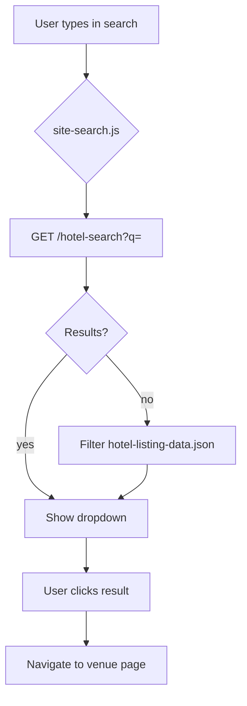

# Public Website — Search & Calculator

Discovery and pricing tools on the public site.

---

## Search

### Header Hotel Search

| | |
| --- | --- |
| **UI** | `#searchbox` overlay on all pages |
| **Script** | `site-public/js/site-search.js` |
| **API** | `GET /hotel-search?q={term}` |
| **Handler** | `worker/public-endpoints.ts` → `calculator-data.searchIndex` |
| **Results** | Max 8 hotel name matches |
| **Fallback** | Client filter on `/data/hotel-listing-data.json` |
| **Auth** | None |

### City Autocomplete (Calculator)

| | |
| --- | --- |
| **API** | `GET /get-cities?search={term}` |
| **Auth** | Same-origin required |
| **Data** | Postgres calculator tables, edited at `/admin/calculator` (India cities only) |
| **Fallback** | `currency-switcher.js` → static JSON |

---

## Calculator Data Architecture

| Source | Location | Updates require |
| --- | --- | --- |
| Postgres | `calculator_*` tables | Admin panel, live within a minute |
| Static JSON | `site-public/data/calculator/*.json` | File edit + deploy |
| Bundled table | `worker/calculator-data.ts` | Seed and fallback only |

### Static JSON files

| File | Contents |
| --- | --- |
| `cities.json` | Indian cities |
| `hotels.json` | All hotels flat list |
| `hotels-by-city.json` | Hotels grouped by city |
| `prices.json` | Monthly price matrix |
| `currencies.json` | INR only |

### Worker-served calculator endpoints

| Endpoint | Auth | Data |
| --- | --- | --- |
| `/data/calculator/cities.json` | None | India-filtered |
| `/data/calculator/hotels.json` | None | India-filtered |
| `/data/calculator/hotels-by-city.json` | None | India-filtered |
| `/data/calculator/prices.json` | None | Full matrix |
| `/data/calculator/currencies.json` | None | INR only |
| `/get-cities` | Same-origin | Autocomplete |
| `/get-hotels-by-city` | Same-origin | Hotels for city |
| `/get-hotels-by-city/:cityId` | Same-origin | By ID |
| `/get-hotel-price/:id/:month` | Same-origin | Single hotel/month |
| `/post /get-hotel-prices` | Same-origin | Batch lookup |
| `/api/calculator/availability-data` | Same-origin | Widget data |

**Blocked (404):** `/data/calculator/calculator-data.json`, `/data/calculator/availability-data.json`

---

## Calculator Tools by Page

### 1. Hotel Cost Calculator (`/hotel-cost-calculator/`)

| | |
| --- | --- |
| **Purpose** | Estimate wedding costs across multiple hotels |
| **UI** | Multi-step: city → hotels → dates → guest count → breakdown |
| **APIs** | Calculator endpoints above |
| **Output** | Client-side cost table with GST |
| **Lead capture** | Optional CTA forms (lead-forms.js) |

### 2. Compare Hotels (`/compare-hotel/`)

| | |
| --- | --- |
| **Purpose** | Side-by-side price comparison (up to 5 hotels) |
| **APIs** | `/get-hotels-by-city`, POST `/get-hotel-prices` |
| **Output** | Comparison table with currency formatting |

### 3. Venue Page Calculator (~259 pages)

| | |
| --- | --- |
| **Purpose** | Per-venue cost estimate with date picker |
| **API** | `GET /get-hotel-price/{external_hotel_id}/{month}` |
| **Hotel ID** | From `hotels.external_hotel_id` (admin-managed or static HTML) |
| **UI** | Inline flatpickr + day sections + offcanvas breakdown |

### 4. Hotel Listing Filter (`/hotel-listing/`, city pages)

| | |
| --- | --- |
| **Purpose** | Filter/browse venues |
| **Data** | `/data/hotel-listing-data.json` + injected CMS cards |
| **Behavior** | Client-side filter, not server search |

---

## Listing Data Files

| File | Purpose |
| --- | --- |
| `site-public/data/hotel-listing-data.json` | Full venue metadata for client filter + search fallback |
| `site-public/data/calculator/*.json` | Offline calculator fallback |

---

## Currency

| | |
| --- | --- |
| **Supported** | INR only |
| **Switcher** | `currency-switcher.js` — display formatting only |
| **API** | `/api/currencies` returns INR; `/api/currencies/select` is stub |

---

## Admin Dependencies

| Admin field | Calculator impact |
| --- | --- |
| `hotels.external_hotel_id` | Links venue page calculator to price data |
| `city_pages.city_id` | City filter on listing pages |
| `city_pages.total_venues` | Pagination count display |

**Calculator prices are admin-editable.** Cities, hotels, the twelve monthly
prices per hotel and the currency list all live in Postgres and are managed at
`/admin/calculator`. `/api/calculator/data` and `/data/calculator/*.json` both
answer from those tables, so every page that prices — the homepage, the
dedicated page, the ten landing pages and all 259 venue pages — picks an edit up
within a minute.

**320 hotels, 277 published.** The source dataset carries prices for 320 hotels
but lists only 259 under `hotels` and `hotelsByCity`. The other 61 are named in
`compareHotelsByCity`, which is what the seed reads for them, and all 61 are
marked `is_active: false` there, so they import with their real name, city and
room count but `published = 0`. Eighteen have since been published to fill
cities that had no hotel at all in the picker. Publishing another is a tick on
its page in `/admin/calculator/hotels`.

Andaman and Haridwar are no longer in the picker. Neither has a hotel in the
dataset at all, published or hidden, so both are `published = 0` on
`calculator_cities` -- the rows are kept because the ids are the dataset's own
and a delete would leave a gap. Their `/destination-wedding/` landing pages are
unaffected: those come from `city_pages`, a different table.

Every city the picker offers now has at least one hotel behind it.

### Price on request

Thirty-three published hotels have no room rate: 24 with every price at 0.00,
and 9 carrying meal prices but no room rate. The calculators all read a rate as
`parseFloat(price.room_price) || 0` and render the result, so without a guard
those hotels quote a wedding at zero — or worse, charge for the catering and
nothing for the rooms.

The guard is the last block of `site-public/js/currency-switcher.js`, which all
272 calculator pages already load, so it needs no page markup or stored shell
changes:

- A `click` listener on `document` in the **capture** phase runs ahead of each
  page's own handler. The rate test needs the dataset promise, so the first
  click is swallowed and replayed with `data-viraaya-rates-checked` once the
  answer is known.
- The hotel comes from `.hotel-select` (comparison), `#hotelSelect` (homepage,
  dedicated page, city pages) or `#hotelId` (venue pages), in that order.
- Unpriced means no room rate in any of the twelve months. `hasRates` is keyed
  on the room rate alone, not on any of the four prices.
- `getHotelPrices` drops unpriced hotels, so the comparison table never shows
  one at zero beside real rates. A comparison where every choice is unpriced
  falls through to the same panel.

The panel is built in JS with inline styles — no Bootstrap dependency — and its
CTA opens `#BookConsultation` where the page has it, or goes to `/contact`.

---

## Edge Cases

| Scenario | Behavior |
| --- | --- |
| Unknown hotel ID in price lookup | Empty/error response from worker |
| Cross-origin calculator API call | 403 blocked |
| Offline/static fallback | `currency-switcher.js` serves local JSON |
| Hotel not in calculator data | No pricing shown on venue calculator |
| Hotel published with no room rate | "Price on request" panel, enquiry CTA instead of a quote |

---

## Search Flow Diagram

