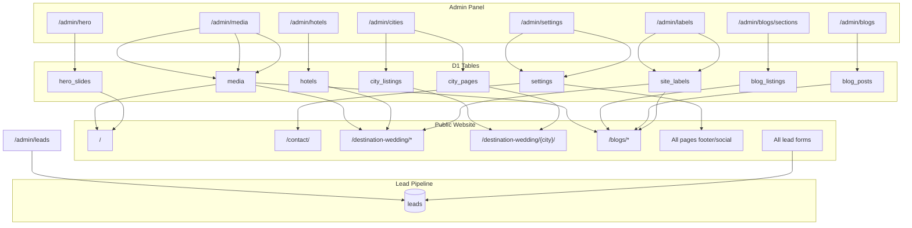

# Website ↔ Admin Dependency Map

**Critical reference:** what admin changes affect the public website.

---

## Overview Diagram

---

## Module-by-Module Dependencies

### Hero Slider (`/admin/hero`)

| Admin action | DB | Public effect | Pages affected |
| --- | --- | --- | --- |
| Create/edit/delete slide | `hero_slides` | Homepage carousel content/images | `/` |
| Publish/unpublish | `hero_slides.published` | Slide visible/hidden | `/` |
| Reorder slides | `hero_slides.position` | Carousel order | `/` |

**Rendering:** `worker/site/hero.ts` → `inject.ts` replaces `div.slider-banner`

---

### Contact Details (`/admin/settings`)

| Admin action | DB keys | Public effect | Pages affected |
| --- | --- | --- | --- |
| Edit phone | `settings.phone` | Contact page phone, footer | `/contact/`, all pages |
| Edit WhatsApp | `settings.whatsappNumber` | WhatsApp float button href | All pages |
| Edit email | `settings.email` | Contact page email | `/contact/` |
| Edit address | `settings.address` | Contact page address lines | `/contact/` |
| Edit social URLs | `settings.instagramUrl`, `linkedinUrl` | Footer social links | All pages |

**Rendering:** `worker/site/settings.ts` (30s cache) → `inject.ts`  
**Cache delay:** Up to 30s for settings, 60s for page HTML

---

### Section Headings (`/admin/labels`)

| Admin action | DB | Public effect |
| --- | --- | --- |
| Edit label value/emphasis | `site_labels` | Section heading text on venue and blog pages |

**Examples:**

| Label key | Appears on |
| --- | --- |
| `venue.amenities` | Venue detail — amenities section |
| `venue.faq` | Venue detail — FAQ heading |
| `venue.glance.*` | Venue detail — at-a-glance labels |
| `blog.toc` | Blog post — table of contents heading |
| `card.readMore` | Listing cards across site |

**Rendering:** `worker/site/labels.ts` → `hotel-inject.ts`, `blog-inject.ts`

---

### Venues (`/admin/hotels`)

| Admin action | DB | Public effect |
| --- | --- | --- |
| Create venue | `hotels` | New page at `/destination-wedding/{city}/{slug}/` |
| Edit content/SEO | `hotels` | All venue page content, meta tags, OG tags |
| Upload images | `hotels.*_image`, R2 | Banner, gallery, card thumbnail |
| Set draft | `hotels.status=draft` | Hidden unless `?preview=1` |
| Delete venue (admin) | DELETE `hotels` | Page removed or reverts to static shell |
| Edit FAQs/highlights | `hotels.faqs`, `hotels.highlights` | FAQ accordion, highlight gallery |
| Edit nearby venues | `hotels.nearby_slugs` | "Similar venues" strip |
| Set external_hotel_id | `hotels.external_hotel_id` | Enquiry form hidden field, calculator linkage |

**Rendering:** `resolve-page.ts` or `hotel-inject.ts`  
**Shell:** `hotels.shell_key` → `page_templates`

---

### City Pages (`/admin/cities`)

| Admin action | DB | Public effect |
| --- | --- | --- |
| Edit venue order | `city_listings` | Which venues appear on city index + order |
| Edit SEO | `city_pages.seo_title`, `meta_description` | City page title and meta |
| Set total_venues | `city_pages.total_venues` | "Showing 1-12 of N" + pagination |
| Set city_id | `city_pages.city_id` | Filter form city ID |

**Rendering:** `venue-listing.ts` → `inject.ts` on `/destination-wedding/{city}/`

---

### Articles (`/admin/blogs`)

| Admin action | DB | Public effect |
| --- | --- | --- |
| Create/edit article | `blog_posts` | Article page content at `/blogs/{slug}/` |
| Set draft | `blog_posts.status=draft` | Hidden unless preview |
| Reorder | `blog_posts.position` | Blog index card order |
| Delete (admin) | DELETE | Page removed |
| Change slug | `blog_posts.slug` | URL changes (no redirect) |

**Rendering:** `blog-inject.ts` patches title, meta, body, FAQ, sidebar form `source_page`

---

### Blog Sections (`/admin/blogs/sections`)

| Admin action | DB | Public effect |
| --- | --- | --- |
| Assign posts to category/tag | `blog_listings` | Which posts appear on `/blogs/category/{slug}/` and `/blogs/tag/{slug}/` |

---

### Media (`/admin/media`)

| Admin action | Storage | Public effect |
| --- | --- | --- |
| Upload image | R2 + `media` | Available at `/media/{key}` |
| Use in content | referenced in HTML fields | Images on venue/blog/hero pages |
| Delete unused (admin) | R2 delete | URL returns 404 |

**Reference tracking:** `worker/admin/image-references.ts` prevents deleting in-use images.

---

### Leads (`/admin/leads`)

| Admin action | DB | Public effect |
| --- | --- | --- |
| *(none directly)* | — | Admin reads submissions from public forms |
| Resend email | `leads.email_sent` | Retries failed notification |
| Update status | `leads.status` | No public effect |

**Public → Admin direction only** for lead content.

---

### Users (`/admin/users`)

| Admin action | Public effect |
| --- | --- |
| Create/disable users | Enables/disables admin panel access |
| No direct public effect | Except preview mode requires active admin session |

---

## Content NOT Managed by Admin

| Content | Source | Location |
| --- | --- | --- |
| Real wedding stories | Static HTML | `/real-weddings/*` |
| Wedding packages | Static HTML | `/wedding-packages/*` |
| City SEO landing pages | Static HTML | `/destination-wedding-in-*` |
| Legal pages | Static HTML | `/privacy-policy/`, etc. |
| About, FAQs, package pages | Static HTML | respective routes |
| Calculator pricing data | Worker bundle | `worker/calculator-data.ts` |
| Static images in clone | ASSETS | `/storage/*` |
| Page chrome (nav, footer structure) | Static HTML shells | All pages |

---

## Change Impact Quick Reference

| If you change... | Public site impact |
| --- | --- |
| `worker/site/inject.ts` selectors | Broken layout on managed pages |
| `worker/site/hotel-inject.ts` | All venue pages break |
| `worker/site/blog-inject.ts` | All blog pages break |
| `site-public/js/lead-forms.js` | All form submissions break |
| `worker/lead-email.ts` | All lead capture + email breaks |
| `worker/calculator-data.ts` | Calculator/compare pricing breaks |
| Admin venue slug | Old URL 404, nearby_slugs may break |
| Admin settings | Contact page + footer + WhatsApp link |
| Admin hero | Homepage carousel only |

See also [Change Impact Map](../13-change-impact.md).
